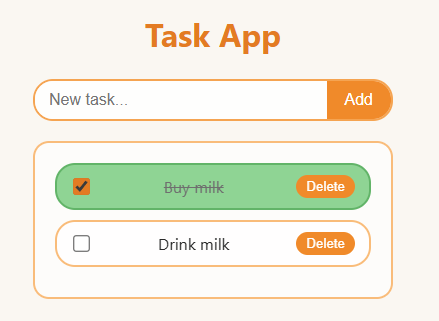

# Chatgpt Tracker

A task tracker made with 100% chatgpt code. 



## Project Structure

As proposed by chatgpt

```
project-root/
│
├── client/
│   ├── src/
│   │   ├── components/
│   │   │   ├── TaskList.jsx
│   │   │   ├── TaskItem.jsx
│   │   │   └── AddTaskForm.jsx
│   │   ├── api.js
│   │   ├── App.jsx
│   │   └── main.jsx
│   └── package.json
│
├── server/
│   ├── routes/
│   │   └── tasks.js
│   ├── controllers/
│   │   └── tasksController.js
│   ├── services/
│   │   └── taskStorage.js
│   ├── data/
│   │   └── tasks.json
│   ├── server.js
│   └── package.json
│
└── README.md
```

## Stack

**Client:**
- React
- Webpack
- Babel

**Server:**
- Node.js
- Express

## API Endpoints

| Method | Endpoint | Description |
|--------|----------|-------------|
| GET | `todo` | Get all tasks |
| POST | `todo` | Create a new task |
| PUT | `todo` | Update a task |
| DELETE | `todo` | Delete a task |
